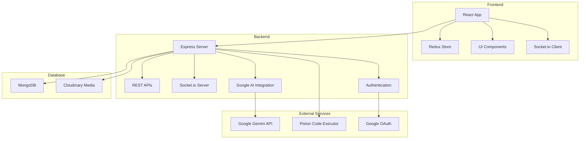

# EduQuest - Gamified Computer Science Education Platform

<div align="center">


[](https://reactjs.org/)
[](https://nodejs.org/)
[](https://www.mongodb.com/)
[](https://expressjs.com/)
[](https://ai.google.dev/)

[](LICENSE)
[](#contributing)

**Transforming CS education through gamification, AI-powered learning, and community-driven growth**

[Live Demo](https://eduquest-demo.vercel.app) • [Documentation](#documentation) • [Report Bug](https://github.com/your-username/eduQuest/issues) • [Request Feature](https://github.com/your-username/eduQuest/issues)

</div>

---

## 📋 Table of Contents

- [ About EduQuest](#-about-eduquest)
- [ Key Features](#-key-features)
- [ Architecture](#️-architecture)
- [ Quick Start](#-quick-start)
- [Installation](#-installation)
- [ Configuration](#️-configuration)
- [ I Features](#-ai-features)
- [ API Documentation](#-api-documentation)
- [ Testing](#-testing)
- [ Contributing](#-contributing)
- [ License](#-license)
- [ Acknowledgments](#-acknowledgments)

---

## About EduQuest

**EduQuest** is a comprehensive, gamified computer science education platform designed to make learning programming interactive, engaging, and effective. By combining modern web technologies with artificial intelligence, EduQuest creates a personalized learning experience that adapts to each student's pace and skill level.

### The EduQuest Experience

- **Learn by Doing**: Interactive coding playgrounds with real-time feedback
- **Compete & Grow**: Multiplayer competitions that challenge and inspire
- **AI-Powered Guidance**: Personalized hints and course generation
- **Community Driven**: Connect with peers, share knowledge, and grow together
- **Gamified Progress**: Earn XP, level up, and unlock achievements

### 🎓 Our Mission

> To democratize computer science education by providing an accessible, engaging, and intelligent learning platform that empowers students to become confident programmers and problem solvers.

---

## Key Features

### Interactive Coding Playgrounds

- **Multi-Language Support**: HTML, CSS, JavaScript, and Python
- **Live Code Execution**: Real-time code compilation and testing
- **Progressive Difficulty**: Problems ranging from beginner to advanced
- **Instant Feedback**: Automated testing with detailed results
- **XP Rewards**: Earn experience points for completed challenges

### Competitive Programming

- **7 Competition Modes**:
  - Classic: Traditional coding challenges
  - Scenario: Real-world problem solving
  - Debug Detective: Find and fix bugs
  - Production Outage: System troubleshooting
  - Code Refactor: Optimize existing code
  - Missing Link: Complete partial solutions
  - Interactive: Hands-on challenges
- **Real-time Multiplayer**: Battle against peers live
- **Leaderboard System**: Global and friend rankings
- **Performance Analytics**: Detailed competition insights

### AI-Powered Learning

- **Smart Course Generation**: AI creates structured courses from topics
- **Intelligent Hints**: Context-aware, progressive hints
- **PDF Processing**: Upload documents for AI summaries and quizzes
- **Personalized Recommendations**: AI suggests next learning steps
- **Code Quality Analysis**: Automated feedback on code improvements

### Social & Community

- **Social Feed**: Share achievements and progress
- **Friends System**: Connect and compete with peers
- **Discussion Forums**: Ask questions and share knowledge
- **Mentorship Opportunities**: Learn from experienced developers

### Gamification Elements

- **Experience System**: Earn XP for all activities
- **Level Progression**: Advance from Novice to Grandmaster
- **Achievement Badges**: Unlock special accomplishments
- **Daily Streaks**: Maintain consistent learning habits
- **Rank Tiers**: Novice → Silver → Gold → Grandmaster

---

## Architecture

### 📐 System Architecture



### Technology Stack

#### Frontend

- **React 19.1.1** - Modern UI framework with concurrent features
- **Vite 7.1.7** - Fast development and build tool
- **Tailwind CSS** - Utility-first CSS framework
- **Radix UI** - Accessible component primitives
- **Redux Toolkit** - State management
- **Monaco Editor** - VS Code editor in the browser
- **Socket.io Client** - Real-time communication
- **Framer Motion** - Smooth animations

#### Backend

- **Node.js 18+** - JavaScript runtime
- **Express 5.2.1** - Web application framework
- **MongoDB 8.20.1** - NoSQL database
- **Mongoose** - MongoDB object modeling
- **Socket.io** - Real-time bidirectional communication
- **JWT** - Authentication tokens
- **Google AI SDK** - Gemini API integration
- **Cloudinary** - Media storage and processing

#### Development Tools

- **ESLint** - Code linting
- **Prettier** - Code formatting
- **Nodemon** - Auto-restart development server
- **Git Hooks** - Pre-commit validation

---

## Quick Start

### Prerequisites

- **Node.js** 18.0.0 or higher
- **npm** 9.0.0 or higher
- **MongoDB** 5.0 or higher (local or cloud)
- **Google AI API Key** (for Gemini features)

### One-Click Setup

```bash
# Clone the repository
git clone https://github.com/your-username/eduQuest.git
cd eduQuest

# Install dependencies and setup environment
npm run setup

# Start development servers
npm run dev
```

### 🌐 Access Points

- **Frontend**: http://localhost:5173
- **Backend API**: http://localhost:5000
- **API Documentation**: http://localhost:5000/api-docs

---

## Installation

### 1. Clone Repository

```bash
git clone https://github.com/your-username/eduQuest.git
cd eduQuest
```

### 2. Install Dependencies

```bash
# Install root dependencies
npm install

# Install client dependencies
cd client
npm install

# Install server dependencies
cd ../server
npm install
```

### 3. Environment Setup

```bash
# Copy environment templates
cp server/.env.example server/.env
cp client/.env.example client/.env

# Edit environment files with your configuration
nano server/.env
nano client/.env
```

### 4. Database Setup

```bash
# Start MongoDB (if running locally)
mongod

# Or connect to MongoDB Atlas
# Update MONGODB_URI in server/.env
```

### 5. Start Development Servers

```bash
# From root directory
npm run dev

# Or start individually
npm run server  # Backend server
npm run client  # Frontend dev server
```

---

## Configuration

### Server Environment Variables (.env)

```env
# Server Configuration
PORT=5000
NODE_ENV=development

# Database
MONGODB_URI=mongodb://localhost:27017/eduquest

# Authentication
JWT_SECRET=your-super-secret-jwt-key
JWT_EXPIRE=7d

# Google Services
GOOGLE_CLIENT_ID=your-google-client-id
GOOGLE_CLIENT_SECRET=your-google-client-secret

# Google AI (Gemini)
GOOGLE_AI_API_KEY=your-gemini-api-key

# Cloudinary (for file uploads)
CLOUDINARY_CLOUD_NAME=your-cloud-name
CLOUDINARY_API_KEY=your-api-key
CLOUDINARY_API_SECRET=your-api-secret

# CORS
CLIENT_URL=http://localhost:5173
```

### Client Environment Variables (.env)

```env
VITE_API_URL=http://localhost:5000
VITE_SOCKET_URL=http://localhost:5000
```

---

## AI Features

### Current AI Implementation

EduQuest leverages **Google's Gemini AI** for multiple intelligent features:

#### AI Course Generator

- **Input**: Topic or subject description
- **Output**: Structured course with chapters and lessons
- **Technology**: Gemini Flash API
- **Endpoint**: `/api/v1/ai/generate-course`

#### PDF Processing

- **Summarization**: Extract key points from uploaded documents
- **Quiz Generation**: Create MCQ questions from document content
- **Technology**: Gemini + PDF parsing
- **Endpoint**: `/api/v1/ai/process-pdf`

#### Smart Competition Questions

- **Dynamic Generation**: Create context-aware competition questions
- **Difficulty Adaptation**: Generate questions at appropriate skill levels
- **Technology**: Gemini API
- **Endpoint**: `/api/v1/ai/generate-questions`

### Planned AI Models

We're developing **5 custom AI models** to enhance the learning experience:

| Model                      | Purpose                                 | Status            |
| -------------------------- | --------------------------------------- | ----------------- |
| Adaptive Difficulty Engine | Personalize problem difficulty          | 🔄 In Development |
| Code Quality Feedback      | Instant code improvement suggestions    | 📋 Planned        |
| Performance Predictor      | Predict student outcomes and churn risk | 📋 Planned        |
| Intelligent Hint Generator | Context-aware progressive hints         | 📋 Planned        |
| Code Similarity Detector   | Ensure academic integrity               | 📋 Planned        |

For detailed AI model specifications, see [AI_MODELS_REQUIREMENTS.md](./ai_model_requirements.md).

---

## API Documentation

### Authentication Endpoints

```http
POST /api/v1/auth/register
POST /api/v1/auth/login
POST /api/v1/auth/google
GET  /api/v1/auth/profile
```

### Playground Endpoints

```http
GET    /api/v1/playground/problems
POST   /api/v1/playground/submit
GET    /api/v1/playground/progress
POST   /api/v1/playground/hint
```

### Competition Endpoints

```http
GET    /api/v1/competition/rooms
POST   /api/v1/competition/create
POST   /api/v1/competition/join
POST   /api/v1/competition/submit
```

### AI Endpoints

```http
POST   /api/v1/ai/generate-course
POST   /api/v1/ai/process-pdf
POST   /api/v1/ai/generate-questions
```

### WebSocket Events

```javascript
// Client-side
socket.emit("join-competition", roomId);
socket.emit("submit-answer", answer);
socket.on("competition-update", data);
socket.on("user-joined", user);
```

---

## Testing

### Running Tests

```bash
# Run all tests
npm test

# Run client tests
cd client && npm test

# Run server tests
cd server && npm test

# Run with coverage
npm run test:coverage
```

### Test Structure

```
├── client/
│   ├── src/
│   │   ├── __tests__/
│   │   │   ├── components/
│   │   │   ├── pages/
│   │   │   └── utils/
│   │   └── setupTests.js
└── server/
    ├── tests/
    │   ├── auth.test.js
    │   ├── playground.test.js
    │   ├── competition.test.js
    │   └── ai.test.js
```

### Testing Technologies

- **Jest** - JavaScript testing framework
- **React Testing Library** - Component testing
- **Supertest** - API endpoint testing
- **MongoDB Memory Server** - Database testing

---

## Contributing

We ❤️ contributions! Whether you're fixing bugs, adding features, or improving documentation, your help is appreciated.

### How to Contribute

1. **Fork the Repository**

   ```bash
   git clone https://github.com/your-username/eduQuest.git
   ```

2. **Create a Feature Branch**

   ```bash
   git checkout -b feature/amazing-feature
   ```

3. **Make Your Changes**
   - Follow the existing code style
   - Add tests for new functionality
   - Update documentation as needed

4. **Run Tests**

   ```bash
   npm test
   ```

5. **Commit Your Changes**

   ```bash
   git commit -m 'Add amazing feature'
   ```

6. **Push to Branch**

   ```bash
   git push origin feature/amazing-feature
   ```

7. **Open a Pull Request**
   - Provide a clear description
   - Reference relevant issues
   - Include screenshots if applicable

### Development Guidelines

- **Code Style**: Follow ESLint configuration
- **Commit Messages**: Use conventional commit format
- **Branch Naming**: `feature/`, `bugfix/`, `docs/`, `test/`
- **Pull Requests**: Keep them focused and reviewable

### Issue Labels

- `bug` - Something isn't working
- `enhancement` - New feature request
- `documentation` - Docs improvement
- `good first issue` - Great for newcomers
- `help wanted` - Community assistance needed

---

## License

This project is licensed under the ISC License - see the [LICENSE](LICENSE) file for details.

```
ISC License

Copyright (c) 2026 EduQuest Contributors

Permission to use, copy, modify, and/or distribute this software for any purpose
with or without fee is hereby granted, provided that the above copyright notice
and this permission notice appear in all copies.
```

---

## Acknowledgments

### Special Thanks

- **Google AI Team** - For the amazing Gemini API
- **MongoDB** - For the excellent database solution
- **React Community** - For the incredible ecosystem

### 🛠️ Dependencies

A huge thank you to all the open-source projects that make EduQuest possible:

- [React](https://reactjs.org/) - UI framework
- [Express](https://expressjs.com/) - Backend framework
- [MongoDB](https://www.mongodb.com/) - Database
- [Tailwind CSS](https://tailwindcss.com/) - CSS framework
- [Radix UI](https://www.radix-ui.com/) - Component primitives
- And many more...

---

## 📞 Contact & Support

### Stay Connected

- **Website**: [eduquest.dev](https://eduquest.dev)
- **Documentation**: [docs.eduquest.dev](https://docs.eduquest.dev)
- **Twitter**: [@EduQuestApp](https://twitter.com/EduQuestApp)
- **Discord**: [Join our community](https://discord.gg/eduquest)

### 📧 Get in Touch

- **Support**: support@eduquest.dev
- **Business**: business@eduquest.dev
- **Security**: security@eduquest.dev

### Report Issues

Found a bug or have a feature request? Please [open an issue](https://github.com/your-username/eduQuest/issues) on GitHub.

---

<div align="center">

**⭐ Star this repository if it helped you!**

Made with ❤️ by the [EduQuest Team](https://github.com/orgs/eduquest/people)

</div>
